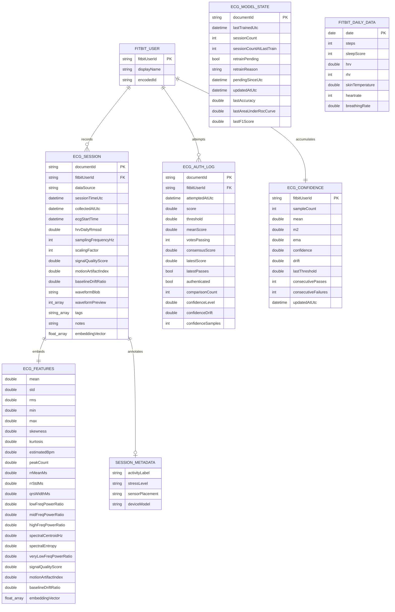

# Firestore EER

This diagram documents the persisted Firestore model used by FitServer today.

- `FITBIT_USER` is a conceptual external entity resolved from the Fitbit profile API, not a Firestore collection.
- `ECG_FEATURES` and `SESSION_METADATA` are embedded objects inside each `ecg_sessions` document.
- `ECG_MODEL_STATE` is a singleton document stored as `ecg_model_state/current`.
- `FITBIT_DAILY_DATA` documents are keyed by date and currently store one daily snapshot per run.

Regenerate with:

```bash
python tools/generate_eer.py --mmd-output docs/eer/firestore_eer.mmd --md-output docs/EER.md
```


