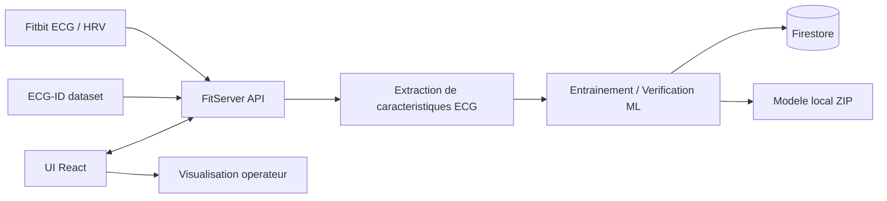

# L2 - Rapport d'avancement

## Projet
**Authentification biometrique ECG a partir de donnees Fitbit**

## Etudiant
Michel Rizkallah

## Formation
Projet Master M2 Cyber

## Remise visee
28 avril 2026

## Version du document
Preparation du livrable L2 redigee a partir de l'etat du depot au 7 avril 2026.

---

## 1. Rappel du sujet

Ce rapport presente l'etat d'avancement du projet a la date du livrable L2. Il a pour objectif de faire le point sur les travaux deja realises, de justifier les choix de conception adoptes et de situer le niveau de maturite actuel de la solution.

L'objectif principal du projet est de concevoir et developper un systeme d'authentification biometrique base sur le signal ECG capture au moyen d'une montre Fitbit. L'idee generale consiste a exploiter les caracteristiques propres a l'activite cardiaque d'un individu afin de verifier son identite de maniere plus fiable qu'avec des mecanismes traditionnels. La solution vise non seulement une verification ponctuelle, mais egalement une verification continue, mieux adaptee a des usages mobiles ou wearables.

Le projet est compose de deux briques principales :

- `FitServer` : backend ASP.NET Core charge de la collecte, de l'extraction de caracteristiques, de l'entrainement du modele, de la verification et du stockage.
- `UI` : interface React destinee a l'operateur pour piloter la collecte, visualiser l'etat des participants, lancer les verifications et suivre les indicateurs.

Le projet s'appuie sur deux sources de donnees :

- les sessions ECG issues de Fitbit ;
- le jeu de donnees public ECG-ID, utilise pour renforcer la diversite des classes et disposer d'un benchmark reproductible.

---

## 2. Avancement global du projet

Au 7 avril 2026, l'avancement du projet est satisfaisant pour une remise L2. La partie **conception** est finalisee, les choix techniques sont fixes, l'architecture applicative est en place et une base de realisation est deja operationnelle sur le backend comme sur l'interface.

### 2.1 Etat d'avancement par lot

| Lot | Etat | Commentaire |
|---|---|---|
| Definition du besoin et cadrage | Termine | Sujet, objectif, perimetre et cas d'usage identifies |
| Cahier des charges | Termine | Document deja present dans `docs/CAHIER_DE_CHARGE.md` |
| Conception fonctionnelle | Termine | Parcours utilisateurs, modules, ecrans et API definis |
| Conception technique | Termine | Architecture backend/frontend, stockage et services definis |
| Backend principal | Avance | Endpoints, services metier, pipeline ECG et persistance en place |
| Interface utilisateur | Avance | Console React avec onglets principaux deja implementes |
| Tests backend | Avance | Tests automatises executes avec succes |
| Tests frontend | Partiel | Strategie definie, scripts presents, couverture a renforcer |
| Industrialisation / deploiement | A poursuivre | Hors priorite immediate du L2 |

### 2.2 Verifications effectuees sur le depot

Les verifications suivantes ont ete faites lors de la preparation de ce rapport :

- le backend compile et les tests passent avec `dotnet test Tests/FitServer.Tests/FitServer.Tests.csproj` ;
- resultat observe : **27 tests passes sur 27** ;
- couverture annoncee par Coverlet : **15.75% lignes**, **10.04% branches**, **27.25% methodes** ;
- l'interface React compile avec `npm run build` dans le dossier `UI` ;
- le build frontend est reussi, avec un avertissement de taille de bundle a optimiser plus tard.

Conclusion : le projet ne se limite pas a une idee ou a une maquette. Une implementation fonctionnelle existe deja et sert de base concrete pour la suite.

---

## 3. Besoin cible et problematique

Les mecanismes d'authentification classiques reposent le plus souvent sur des mots de passe, des codes PIN ou des moyens externes de verification. Bien que largement utilises, ces dispositifs presentent plusieurs limites en pratique :

- elles peuvent etre oubliees, partagees ou volees ;
- elles ne garantissent pas forcement que l'utilisateur legitime est toujours present apres la connexion initiale ;
- elles sont peu adaptees a une verification continue dans un contexte mobile ou wearable.

Dans ce contexte, la biometrie apparait comme une alternative interessante. L'utilisation de l'ECG est particulierement pertinente, car il s'agit d'un signal physiologique interne, propre a l'individu et difficile a reproduire artificiellement. Contrairement a des facteurs plus classiques, il permet d'envisager une authentification plus robuste, mais aussi potentiellement continue, tant que le wearable reste porte par l'utilisateur.

Le projet cherche donc a repondre a la problematique suivante :

**Comment verifier l'identite d'un utilisateur de maniere plus naturelle, plus continue et plus difficile a usurper, en exploitant le signal ECG capture par une montre Fitbit ?**

Cette problematique se situe a l'intersection de plusieurs enjeux :

- un enjeu de securite, en reduisant les risques d'usurpation d'identite ;
- un enjeu d'usage, en proposant une authentification moins intrusive pour l'utilisateur ;
- un enjeu scientifique, en confrontant les approches de biometrie ECG a des donnees reelles issues d'un wearable.

L'opportunite du projet est donc double :

- sur le plan scientifique, il permet de confronter les travaux de la litterature a un cas d'usage concret sur wearable ;
- sur le plan logiciel, il mobilise l'ensemble de la chaine d'ingenierie : collecte, traitement du signal, API, machine learning, UI, tests, documentation.

## 4. Presentation generale du projet

Le projet repose sur deux composants principaux, complementaires et clairement separes.

Le premier composant est `FitServer`, un backend developpe en ASP.NET Core. Il prend en charge l'ensemble de la logique applicative : communication avec les donnees Fitbit, collecte des sessions ECG, extraction de caracteristiques, entrainement du modele, verification des tentatives et exposition des services REST utilises par l'interface. Il constitue le noyau technique de la solution.

Le second composant est `UI`, une interface utilisateur developpee avec React et TypeScript. Elle permet a l'operateur de superviser les participants, de lancer les captures, de configurer les verifications, de suivre les resultats et d'analyser les performances du systeme au travers de tableaux, cartes et graphiques.

Les donnees exploitees par le projet proviennent de deux sources principales :

- les donnees issues de Fitbit, qui correspondent au cas d'usage reel vise par la solution ;
- le dataset public ECG-ID, utilise comme source complementaire pour le benchmark, l'evaluation comparative et l'augmentation de la diversite des donnees.

Ce choix permet de combiner une approche appliquee, centree sur l'usage wearable, avec une base de reference plus standardisee pour l'evaluation scientifique.

---

## 5. Conception finalisee

Cette section correspond a la partie obligatoire du livrable L2. Les decisions de conception sont arretees et coherentes avec le code existant.

### 5.1 Acteurs du systeme

- **Participant** : il s'agit de la personne qui fournit les signaux ECG exploites par le systeme. Le participant intervient principalement lors de la phase d'enrollement, durant laquelle plusieurs sessions doivent etre capturees afin de constituer une base de reference biometrque, puis lors des phases de verification ponctuelle ou continue.
- **Operateur** : l'operateur est l'utilisateur de l'interface de supervision. Il selectionne les participants, lance les captures, renseigne les metadonnees de contexte, declenche l'entrainement du modele et analyse les resultats de verification. Son role est essentiel pour garantir la qualite des donnees collectees et l'interpretation correcte des performances du systeme.
- **Fitbit API** : cette API represente la source externe de donnees physiologiques. Elle permet de recuperer les lectures ECG et certaines mesures complementaires comme la HRV. Elle constitue donc le point d'entree des donnees brutes utilisees par la solution.
- **FitServer** : le backend joue le role de coeur applicatif. Il centralise la logique metier, assure la collecte des sessions, l'extraction des caracteristiques ECG, l'entrainement du modele, les verifications ponctuelles et continues, ainsi que l'exposition des services REST consommes par l'interface utilisateur.
- **Firestore** : Firestore assure la persistance des donnees du systeme. Sont notamment stockes les enregistrements ECG, les metadonnees associees, les journaux de verification, l'etat du modele et les indicateurs de confiance. Ce stockage permet d'assurer la tracabilite des essais et le suivi de l'evolution du systeme dans le temps.

### 5.2 Cas d'usage principaux

Le systeme final couvre cinq cas d'usage centraux :

1. **Enroler un participant**
   - Ce cas d'usage correspond a la constitution du profil biometrque initial d'un utilisateur.
   - L'operateur selectionne un participant, lance une capture ECG, ajoute les informations de contexte utiles puis valide l'enregistrement.
   - Le systeme extrait ensuite les caracteristiques du signal et stocke la session afin d'alimenter la base d'apprentissage.
   - Cette phase est fondamentale, car la qualite et la quantite des sessions d'enrollement conditionnent directement la performance du modele.

2. **Entrainer un modele**
   - Une fois un nombre suffisant de sessions collectees, l'operateur peut lancer l'entrainement du modele biometrque.
   - Le backend prepare les donnees, construit les paires d'apprentissage, applique le pipeline de traitement puis calcule les metriques de performance.
   - Le modele produit est ensuite sauvegarde, de meme que les indicateurs associes tels que l'accuracy, l'AUC et le F1-score.
   - Ce cas d'usage permet donc de passer d'une simple collecte de donnees a une exploitation effective de la biometrie ECG.

3. **Verifier une tentative**
   - Ce cas d'usage consiste a verifier si une nouvelle lecture ECG correspond bien au profil d'un participant deja enregistre.
   - Le systeme capture un nouvel echantillon, le compare aux sessions de reference, calcule un score de similarite puis applique un seuil de decision.
   - Le resultat est presente a l'operateur sous forme d'un verdict d'acceptation ou de rejet, accompagne de scores detaillees et d'informations de confiance.
   - Chaque tentative est journalisee afin de permettre une analyse ulterieure des performances.

4. **Verifier en continu**
   - Au-dela de la verification ponctuelle, le projet integre une logique de verification continue.
   - Le signal est analyse sur des fenetres temporelles glissantes, chacune donnant lieu a un score d'authentification.
   - Cette approche permet de detecter une derive, une baisse de qualite du signal ou une incoherence dans le comportement du systeme sur la duree.
   - Elle repond a un besoin important dans les scenarios ou l'authentification ne doit pas etre limitee a un seul instant initial.

5. **Analyser les performances**
   - Enfin, le systeme doit permettre une analyse detaillee de ses performances.
   - L'operateur peut consulter les tentatives genuine et impostor, suivre les indicateurs FAR, FRR et EER estime, et observer l'evolution des scores dans le temps.
   - Un benchmark sur ECG-ID est egalement prevu afin de comparer les resultats obtenus sur wearable a une base de reference issue de la litterature.
   - Ce cas d'usage est indispensable pour evaluer objectivement la pertinence de la solution et orienter les ameliorations futures.

### 5.3 Architecture retenue

L'architecture retenue est une architecture separee frontend/backend, suffisamment modulaire pour isoler la logique metier ECG, l'exposition API et l'interface operateur.

#### Backend

Le backend repose sur ASP.NET Core 9.0. La structure deja en place comprend :

- un controleur principal `Controllers/EcgAuthController.cs` ;
- des services specialises pour l'extraction de caracteristiques, l'augmentation, l'embedding, l'entrainement, la modelisation de confiance et la communication Fitbit ;
- un middleware d'authentification Fitbit ;
- des jobs de fond pour l'alimentation et la supervision adaptative.

Les endpoints principaux actuellement exposes sont :

- `POST /api/ecg-auth/collect-session`
- `POST /api/ecg-auth/train`
- `POST /api/ecg-auth/verify`
- `POST /api/ecg-auth/continuous-verify`
- `GET /api/ecg-auth/sessions`
- `POST /api/ecg-auth/benchmark-ecg-id`

#### Frontend

L'interface utilisateur est developpee avec React 19, TypeScript et Vite. Elle sert de console operateur et s'organise en cinq onglets :

- `Participants`
- `Enrollment`
- `Verification`
- `Continuous`
- `Analytics`

Cette separation correspond directement aux besoins fonctionnels du projet et confirme que la conception UI n'est plus au stade theorique.

### 5.4 Conception des modules fonctionnels

L'interface et le backend ont ete concus autour de modules fonctionnels clairement identifies. Cette decomposition permet de separer les responsabilites, de faciliter la maintenance du projet et d'assurer une meilleure lisibilite du parcours utilisateur. Chaque module correspond a une etape importante du cycle de vie de la solution biometrque, depuis la gestion des participants jusqu'a l'analyse des performances.

#### Module 1 - Participants

Le module `Participants` constitue le point d'entree principal de la console operateur. Il centralise la liste des utilisateurs identifies dans le systeme et permet d'obtenir une vision rapide de leur etat d'avancement.

Ce module assure notamment :

- l'affichage des identifiants Fitbit detectes ;
- l'association d'alias afin de faciliter la lecture et l'identification des participants ;
- le suivi du nombre de sessions deja collectees ;
- l'estimation de la progression de l'enrollement ;
- l'acces rapide aux actions de collecte, de verification et d'entrainement.

D'un point de vue fonctionnel, ce module joue un role de supervision. Il permet a l'operateur de savoir quels participants sont encore incomplets, lesquels sont prets pour l'apprentissage et quels profils necessitent de nouvelles acquisitions.

#### Module 2 - Enrollment

Le module `Enrollment` formalise la phase d'enrollement, c'est-a-dire la constitution du profil biometrque initial de l'utilisateur. Cette phase a ete pensee comme un processus guide afin de limiter les erreurs de manipulation et d'ameliorer la qualite des donnees capturees.

Le parcours se decompose en trois etapes :

- une phase d'instructions, durant laquelle l'operateur prepare le participant et verifie les conditions de mesure ;
- une phase de capture ECG sur une duree definie, avec un retour visuel de progression ;
- une phase de synthese, permettant de consulter les caracteristiques extraites et d'evaluer rapidement la qualite de la session.

Le module integre egalement la saisie de metadonnees de contexte, comme l'activite, le niveau de stress, la position du capteur, le modele de montre, des tags ou des notes. Ces informations sont utiles pour la tracabilite des acquisitions et pour l'analyse ulterieure des variations de performance.

#### Module 3 - Verification

Le module `Verification` couvre la verification ponctuelle d'une tentative d'authentification. Il s'agit du module le plus directement lie a la finalite du projet, puisqu'il permet de verifier si un nouvel echantillon ECG correspond bien au profil d'un utilisateur prealablement enregistre.

Fonctionnellement, ce module permet :

- de regler le seuil de decision ;
- de lancer une tentative de verification ;
- de distinguer les cas genuine et impostor ;
- d'ajouter des notes de contexte ;
- de consulter le score obtenu et le verdict final ;
- d'afficher les comparaisons avec les sessions de reference ;
- de suivre des indicateurs de confiance et de derive.

Ce module permet donc non seulement de produire une decision d'authentification, mais egalement de documenter et d'interpreter les conditions dans lesquelles cette decision a ete prise.

#### Module 4 - Continuous monitoring

Le module `Continuous monitoring` etend la logique precedente a une verification dans le temps. Au lieu de s'appuyer sur une seule lecture, le systeme analyse plusieurs fenetres temporelles successives afin de produire une vision dynamique du comportement biometrque.

Ce module prend en charge :

- le parametrage du seuil ;
- la definition de la taille des fenetres temporelles ;
- le choix du pas de glissement ;
- la visualisation des scores sur l'ensemble de la sequence analysee ;
- la consultation d'un journal des fenetres et de leur statut.

Cette approche est importante, car elle introduit une dimension de continuite dans l'authentification. Elle permet notamment d'identifier une instabilite du signal, une perte de qualite ou une derive progressive du comportement du modele.

#### Module 5 - Analytics

Le module `Analytics` regroupe l'ensemble des fonctionnalites de suivi et d'evaluation des performances. Son objectif est de transformer les resultats bruts issus de la verification en indicateurs interpretables par l'operateur et exploitables dans le cadre du projet.

Il permet notamment :

- de suivre l'evolution des scores dans le temps ;
- de distinguer les essais genuine et impostor ;
- de calculer et d'afficher les indicateurs FAR, FRR et EER estime ;
- de visualiser des graphiques d'entrainement, comme la courbe ROC ou la distribution des scores ;
- d'executer un benchmark ECG-ID afin de comparer la solution wearable a une base de reference plus standardisee.

Ce module joue un role central dans la validation de la solution, car il permet de mesurer objectivement les performances du systeme et d'orienter les ameliorations a apporter.

### 5.5 Modele de donnees finalise

Le modele de donnees a ete defini de maniere a couvrir l'ensemble du cycle de vie de la solution : acquisition des signaux, exploitation des tentatives d'authentification, suivi du modele et historisation des indicateurs de confiance. Il est documente plus en detail dans `docs/EER.md`.

Les principales entites retenues sont les suivantes :

- `ecg_sessions` pour stocker les sessions ECG capturees ;
- `ecg_auth_logs` pour enregistrer les tentatives d'authentification et leurs resultats ;
- `ecg_confidence` pour suivre les indicateurs de confiance et de derive ;
- `ecg_model_state` pour memoriser l'etat global du modele entraine.

#### Sessions ECG

La collection `ecg_sessions` constitue la base principale du systeme. Chaque enregistrement correspond a une session ECG associee a un utilisateur Fitbit.

On y retrouve notamment :

- l'identifiant du participant ;
- la date et l'heure de la session ;
- les echantillons ou representations du signal ;
- les caracteristiques extraites ;
- les mesures complementaires comme la HRV ;
- les metadonnees de contexte et les notes operateur.

Cette collection joue un role central, car elle alimente aussi bien l'enrollement que l'entrainement du modele et certaines comparaisons effectuees lors de la verification.

#### Logs d'authentification

La collection `ecg_auth_logs` est dediee a la tracabilite des tentatives de verification. Chaque tentative y est conservee avec les informations necessaires a l'analyse des performances.

Les elements stockes couvrent par exemple :

- le participant concerne ;
- le score obtenu ;
- le seuil applique ;
- le verdict final d'acceptation ou de rejet ;
- les comparaisons effectuees ;
- les eventuels labels genuine ou impostor ;
- des informations de confiance ou de derive associees a la tentative.

L'existence de ces logs est essentielle pour produire des indicateurs comme le FAR, le FRR ou l'EER estime, mais aussi pour comprendre les cas d'erreur ou les situations ambigues.

#### Etat du modele

La collection `ecg_model_state` permet de suivre l'etat courant du modele biometrque. Elle conserve des informations comme :

- la date du dernier entrainement ;
- le nombre de sessions disponibles ;
- le nombre de sessions prises en compte lors du dernier apprentissage ;
- l'etat d'une demande de re-entrainement ;
- les metriques obtenues, telles que l'accuracy, l'AUC et le F1-score.

Ce mecanisme permet d'assurer une certaine gouvernance du cycle de vie du modele et de savoir a quel moment une mise a jour devient necessaire.

#### Interet du choix de Firestore

Le recours a Firestore est coherent avec la nature du projet pour plusieurs raisons :

- il offre une structure suffisamment souple pour stocker des donnees heterogenes et evolutives ;
- il facilite l'enregistrement de documents enrichis par des champs de metadonnees ;
- il s'integre naturellement a l'ecosysteme Google deja mobilise dans le projet.

Au global, le modele de donnees retenu est suffisamment riche pour assurer la collecte, la tracabilite, l'evaluation et l'adaptation du systeme biometrque.

### 5.6 Conception de l'extraction de caracteristiques

Le service `Services/EcgFeatureExtractor.cs` montre que la chaine de traitement du signal est deja precisee. Les caracteristiques retenues couvrent plusieurs familles :

- statistiques de base : moyenne, ecart-type, RMS, min, max ;
- morphologie du signal : pics, RR mean/std, largeur QRS ;
- domaine frequentiel : puissances relatives par bandes, centroid spectral, entropie ;
- qualite du signal : score de qualite, artefacts de mouvement, derive de ligne de base.

Cette conception est pertinente pour deux raisons :

- elle combine des descripteurs interpretables du signal ECG ;
- elle prepare une authentification robuste face aux variations de bruit et de contexte.

### 5.7 Choix technologiques retenus

| Domaine | Choix |
|---|---|
| Backend | ASP.NET Core 9.0 |
| Frontend | React 19 + TypeScript + Vite |
| Appels API | Axios |
| Data fetching UI | TanStack Query |
| Graphiques UI | Recharts |
| Stockage | Firestore |
| Tests backend | xUnit + WebApplicationFactory + Coverlet |
| Tests frontend | Vitest + Testing Library + Playwright |
| ML / traitement | services C# dedies + artefacts ZIP |

Ces choix sont maintenant stabilises. La conception technique peut donc etre consideree comme finalisee.

### 5.8 Conception visuelle de l'interface

Le dossier `UI` montre une interface deja structuree, avec une direction visuelle claire :

- bandeau d'entete sombre avec etat du backend ;
- navigation par onglets ;
- cartes de synthese ;
- tableaux de suivi ;
- controles interactifs ;
- graphiques analytiques ;
- mise en page responsive.

La feuille `UI/src/App.css` confirme un parti pris simple et professionnel :

- contraste eleve ;
- separation nette des blocs fonctionnels ;
- composants lisibles pour des manipulations en contexte de laboratoire ;
- adaptation mobile basique deja prevue.

Le visuel n'est donc pas une simple intention. Il existe une base front exploitable qui accompagne la conception fonctionnelle.

---

## 6. Realisation deja en place

### 6.1 Ce qui est deja realise

- structure complete du backend ;
- services ECG et logique metier principaux ;
- persistance Firestore ;
- endpoints REST principaux ;
- benchmark ECG-ID ;
- mecanisme de confiance / derive ;
- interface React a onglets ;
- premiers tests automatises backend ;
- configuration des tests frontend ;
- documentation technique de base (`README.md`, `docs/ECG_AUTH.md`, `docs/EER.md`, `docs/CAHIER_DE_CHARGE.md`).

### 6.2 Ce qui reste a consolider

- enrichir les campagnes de tests frontend ;
- augmenter la couverture backend ;
- optimiser le bundle frontend ;
- consolider les donnees experimentales Fitbit ;
- formaliser les resultats comparatifs finaux pour la soutenance ;
- industrialiser l'installation et le deploiement si necessaire.

---

## 7. Tests, validation et niveau de maturite

### 7.1 Backend

Le backend dispose d'une base de tests deja exploitable. Lors de la verification effectuee pour ce rapport :

- **27 tests ont passe sur 27** ;
- le projet compile correctement ;
- les rapports de couverture sont generes dans `TestResults/coverage/`.

Ce point est important car il montre une demarche de qualite logicielle deja engagee.

### 7.2 Frontend

Le frontend a ete verifie au niveau build :

- `npm run build` execute avec succes dans `UI` ;
- la version de production est generee ;
- un avertissement de taille de chunk subsiste et devra etre traite.

Les scripts de tests unitaires et end-to-end existent deja dans `package.json`, ce qui valide la strategie de QA, meme si cette partie doit encore etre renforcee d'ici le rendu final.

### 7.3 Niveau de maturite au stade L2

Le projet peut etre qualifie de **prototype fonctionnel avance** :

- la conception est finalisee ;
- la realisation est deja bien engagee ;
- les briques critiques existent ;
- il reste surtout un travail de consolidation, de validation experimentale et de finition.

---

## 8. Risques identifies et plan d'attenuation

| Risque | Impact | Action prevue |
|---|---|---|
| Variabilite du signal ECG Fitbit | Degradation des scores | Renforcer la qualite de collecte et l'analyse des metadonnees |
| Quantite limitee de donnees proprietaires Fitbit | Generalisation reduite | Exploiter ECG-ID comme base complementaire et benchmark |
| Couverture de tests encore faible | Regressions possibles | Ajouter des tests sur services critiques et parcours UI |
| Taille du bundle frontend | Impact performance | Introduire du code splitting ou reorganisation des imports |
| Derive biometrique dans le temps | Resultats instables | Suivi via confidence modeling et retrain adaptatif |

---

## 9. Planning jusqu'au rendu final

### Avant le rapport final du 21 mai 2026

1. Consolider les campagnes de collecte et les essais Fitbit.
2. Produire des resultats quantitatifs plus complets sur les performances du modele.
3. Renforcer les tests front et back.
4. Finaliser la documentation d'installation et d'execution.
5. Preparer les supports de soutenance et les demonstrations.

---

## 10. Conclusion

Au stade du livrable L2 du **28 avril 2026**, le projet presente un avancement coherent et serieux. La **conception est finalisee** :

- le besoin est clairement formule ;
- l'architecture est arretee ;
- les modules fonctionnels sont definis ;
- le modele de donnees est structure ;
- les choix technologiques sont fixes ;
- le visuel UI existe deja sous forme d'une console operateur exploitable.

En plus de cette conception finalisee, le projet dispose deja d'une implementation concrete, d'un backend teste et d'un frontend compilable. La suite du travail portera donc principalement sur la consolidation experimentale, l'amelioration de la qualite et la preparation du rendu final.

---

## 11. Annexes utiles

- Cahier des charges : `docs/CAHIER_DE_CHARGE.md`
- Workflow backend : `docs/ECG_AUTH.md`
- Modele de donnees : `docs/EER.md`
- Backend principal : `Program.cs`
- Controleur API : `Controllers/EcgAuthController.cs`
- Extraction de caracteristiques : `Services/EcgFeatureExtractor.cs`
- Interface React : `../UI`
